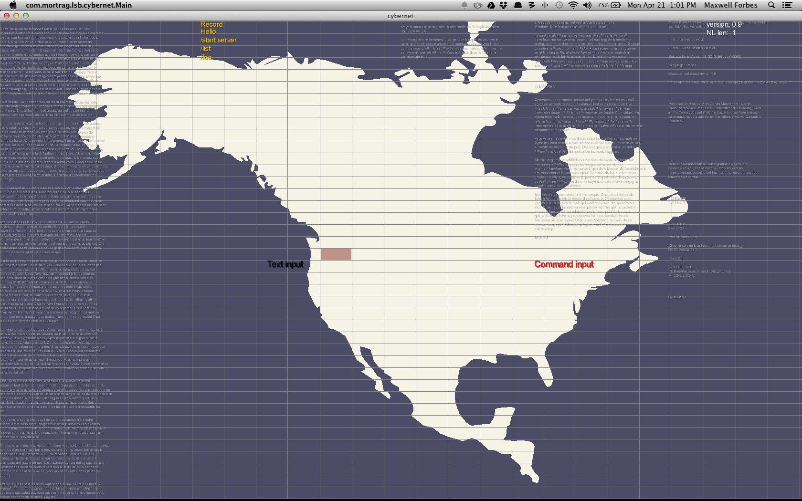

# cybernet

A small "game" to test out libGDX. Some background graphics and string streams, plus a very basic chat program that operates over TCP to message someone else using cybernet (not encrypted).

Eats CPU by using bad String manipulation :-)
